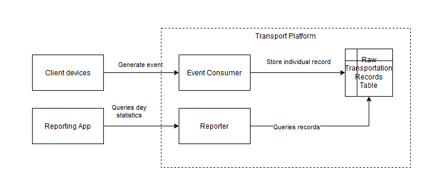
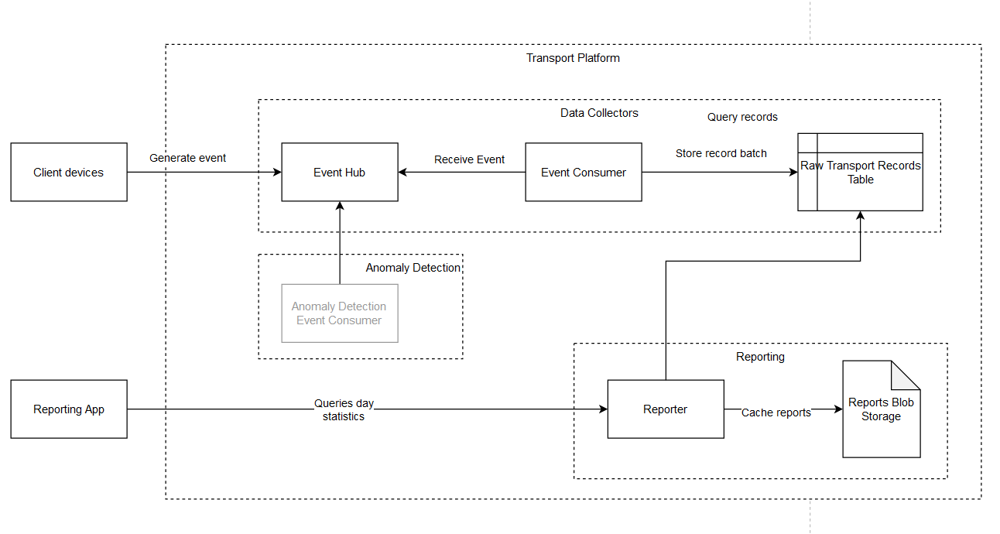

Walkthrough - Practicals 2


# Problem

The situation has changed in the following way: 
- The business is thriving and the number of smart warehouses is about to increase from one to a hundred.
- The client request a simple anomaly detection tool.

The architecture would need to adjust at multiple levels

## API

The clients need to send an id of the warehouse they belong to and our Event Collector, Reporter and transports table need to be adjusted. 

## Reporting

We can expect increase demand of requests not only for the separate warehouse but even for the same warehouse (more people need the same data). The Report endpoint can no longer calculate the statistics on-the-fly, it should either precompute them or cache them in some storage.

## Anomaly Detection

This feature is developed by a different team (they will maybe use [Azure Stream Analytics](https://azure.microsoft.com/en-us/services/stream-analytics/#features) or something else, we don't know) but we need to integrate with them.


# Design

This is the previous design.





- The input data would require a new field `warehouseId` and this needs to be propagated throughout the system
- We would need abandon Azure Function event consumer in favor of event hub because of predictable scaling and that each event is now being read by two different components.
- More requests on reporter requires us to avoid on-the-fly computation. We can 
  - Create a cron job that will process the data for the previous day.
  - Create the reports on demand.


**Note** that working with time is a hassle. Daylight savings, time zones, manual changes is an issue in distributed programing. Therefore we expect all records to come from one timezone and the datetime corresponds precisely to the time of the transportation.

## Components

- Event Hub
  - Event Consumer
- HTTP API
  - Reporter
- Storage
  - Transport Table
  - Report Blobs

The Azure Function Event Consumer has been abandoned from the following reason
- We have more than one event processor. The Azure Function accepting the request would need to store the event and notify the Anomaly Detection component which is not desirable (synchronous calls should be performed carefully).
- Predictable scaling behavior. While Azure Functions can scale out, it still takes a while and could cost a fortune. Putting events to the Event Hub allow us to smooth the spikes and if needed it does not block us from adding more consumers to help out with the situation.
- An error in the function will cause loss of data. 

## API Changes

### Event Consumer

Add `warehouseId`: 

```json
{
  "locationFrom":<string>,
  "locationTo":<string>,
  "timeSpentSec":<number>,
  "objectId":<string>,
  "warehouseId":<string>,
  "transportedDateTime":<string>,
}
```

### Reporter

Add a Request Query Parameters: 
- `warehouse`- an ID of a given warehouse


# Implementation

- Event Consumer Api - [Event Hub](https://docs.microsoft.com/en-us/azure/event-hubs/)
- Storage - [Azure Blob storage](https://docs.microsoft.com/en-us/azure/storage/blobs/storage-blobs-introduction)

# Steps

## Upgrade the Infrastructure

We will add an Event Hub with two consumer groups, one for each type of consumers - Anomaly Detection component and Event Consumer. On the top of that we will add a blob storage to store the cached reports.

We can use the same resource group as previously since the ARM template deployment is idempotent therefore the existing architecture won't be affected.

The Azure Function "Event Consumer" is not needed but we **won't remove it yet**. It will be done once the client has successfully integrated with the new version. We don't want to lose any data.

**Deploying ARM templates is idempotent, we don't need to delete the previous resource group**

```
cd /
az deployment group create \
  --name "deploy-mff-task-components" \
  --resource-group <resource-group> \
  --template-file "arm/resources.azrm.json" \
  --parameters "arm/resources.azrm.parameters.json"
```

In the output, you will get sending and listening connection strings. Note them somewhere, you will need the sending connection string in the event generator and the listening one should you want to debug the solution.

## Adjust the Event Consumer

We add a new property `warehouseId` to the class representing request `Transport`:

```cs
[JsonPropertyName("warehouseId")]
public string WarehouseId { get; set; }
```

The `TransportEntity` will be changed as well. We will keep the transported date as a row key (because we still want to perform querying based on a datetime). To keep the querying efficient, we will re-define row key as a combination of warehouse Id and a transport Id so it would be unique and ordered by the warehouse. The design is based on the tips from the [documentation](https://docs.microsoft.com/en-us/azure/storage/tables/table-storage-design-for-query)

And we reflect that in the function mapping from model to entity.

## Add another event hub triggered Azure Function

Create a new Azure function project with the version 2 component.

```
func init "AzureFunctionsV2" --worker-runtime "dotnetIsolated"
cd "AzureFunctionsEventHub"
func new --name "EventConsumerEh" --template "eventhub"
```

Notice the 
- Event Hub name
- Event Hub connection string property name - from env property to app configuration
- `eventHubMessages` array of transports. 

```cs
public static class EventConsumerEh
{
    
    private const string _eventHubName = "client-events";
    private const string _eventHubSenderConnectionString = "clientEventsListenerEventHubConnectionString";
    [Function("EventConsumerEh")]
    public static void Run(
        [EventHubTrigger(_eventHubName, Connection = _eventHubSenderConnectionString)] 
        Transport[] transports, 
        FunctionContext context)
    {
        var logger = context.GetLogger("EventConsumerEh");
        logger.LogInformation($"First Event Hubs triggered message: {transports[0].ObjectId}");
        
        // TODO storing logic similar to the previous one
    }
}
```

Publish and test it.

```
func azure functionApp publish $resourceGroup
```

Test that it works. You would need to slightly redesign it's row key [see here](https://docs.microsoft.com/en-us/azure/storage/tables/table-storage-design-for-query)


# Homework adjustments

## Implement logic of the Event Consumer

You can reuse the logic from the previous version.

## Reporter

Add reporter HTTP function to V2 project and continue.

Let's start with adjusting the queries. In the example solution, there is a service `AggregationService` which will be used as an example.

In the previous solution, this service queried the table using partition key and it calculated all the results on the fly. This design will not be changed significantly. We will only need to use warehouse as identifier and a reflect this in Azure Table design.

Because of the Azure Table query feature that returns all records sorted by Partition key and then by Row key (see documentation [here](https://docs.microsoft.com/en-us/azure/storage/tables/table-storage-design-for-query#sorting-data-in-the-table-service)), we can reuse it with a slight change - we add the warehouse to the date.

Before we present the algorithm, we will show an auxiliary class used to keep the stats
```cs
private class WarehouseRunningStats
{
    public WarehouseRunningStats(string warehouseId)
    {
        WarehouseId = warehouseId;
    }
    public string WarehouseId { get; }

    public double SumTime { get; set; }
    public int TotalTransported { get; set; }
}
```

And a class to warehouse specific statistics

```cs
public class WarehouseDayStatistics
{
  public WarehouseDayStatistics(
      string warehouseId,
      DateTimeOffset day,
      int totalTransported,
      double averageTimeOfTransportation)
  {
      if (string.IsNullOrEmpty(warehouseId))
      {
          throw new ArgumentException($"'{nameof(warehouseId)}' cannot be null or empty.", nameof(warehouseId));
      }

      WarehouseId = warehouseId;
      Day = day;
      TotalTransported = totalTransported;
      AverageTimeOfTransportation = averageTimeOfTransportation;
  }
  public WarehouseDayStatistics() {}
  
  [JsonPropertyName("warehouseId")]
  public string WarehouseId { get; set; } = null!;


  [JsonPropertyName("day")]
  public DateTimeOffset Day { get; set; }

  [JsonPropertyName("totalTransported")]
  public int TotalTransported { get; set; }

  [JsonPropertyName("avgTimeOfTransportation")]
  public double AverageTimeOfTransportation { get; set; }
}
```

The algorithm will see only few changes.

```cs
var warehouses = new List<WarehouseDayStatistics>();
WarehouseRunningStats? currentWarehouse = null;

await foreach (var item in _repository.GetTransportsInADay(dateTimeOffset))
{
    if (currentWarehouse is null)
    {
        currentWarehouse = new WarehouseRunningStats(item.WarehouseId);
    }

    if (currentWarehouse.WarehouseId != item.WarehouseId)
    {
        var warehouseStats = new WarehouseDayStatistics(
            currentWarehouse.WarehouseId,
            dateTimeOffset.Date,
            currentWarehouse.TotalTransported,
            currentWarehouse.SumTime / currentWarehouse.TotalTransported
        );

        warehouses.Add(warehouseStats);
        currentWarehouse = new WarehouseRunningStats(item.WarehouseId);
    }
    else
    {
        currentWarehouse.SumTime += item.TimeSpentSeconds!.Value;
        currentWarehouse.TotalTransported++;
    }
}
```

Now we will create a service for adding and loading blobs.

Add blob package

```pwsh
dotnet add package Azure.Storage.Blobs
```

Add blob client code. Notice that you are requesting a reference to a blob container that you have not created. This particular container has been created by the arm template used above.
```cs
var storageConnectionString = Environment.GetEnvironmentVariable("StorageAccountConnectionString");
var blobServiceClient = new BlobServiceClient(storageConnectionString);
blobContainerClient = blobServiceClient.GetBlobContainerClient(_containerName);
```

And then, for each warehouse statistics, you create a new blob and write the json statistics into it.

```cs
var blobName = $"{warehouseStats.WarehouseId}/{day}";
var blobClient = blobContainerClient.GetBlobClient(blobName);

var json = JsonSerializer.Serialize(warehouseStats);

using var stream = new MemoryStream();
using var writer = new StreamWriter(stream);
writer.Write(json);
writer.Flush();
stream.Position = 0;

await blobClient.UploadAsync(stream, true);
```

## Test

Publish and test the function.

You can run event generator `sln/EventGenerator` with the URI of the event consumer function. It will is an endless generator of transport records.

Then you can use the TimedStatsAggregator to create the reports.

You can also open Azure Storage Explorer and check the blob storage. Find the table under your subscription -> Storage Accounts -> `<your storage_name>` -> Blob Container -> `cachedreports` and check that all the reports are there.

And lastly you can check the Reporter API. You should receive the report in the form similar to the one from the previous session but now with warehouse ID

```json
{
  "warehouseId":"warehouse_03",
  "day":"2021-04-05T00:00:00+00:00",
  "totalTransported":110,
  "avgTimeOfTransportation":52.27272727272727
}
```