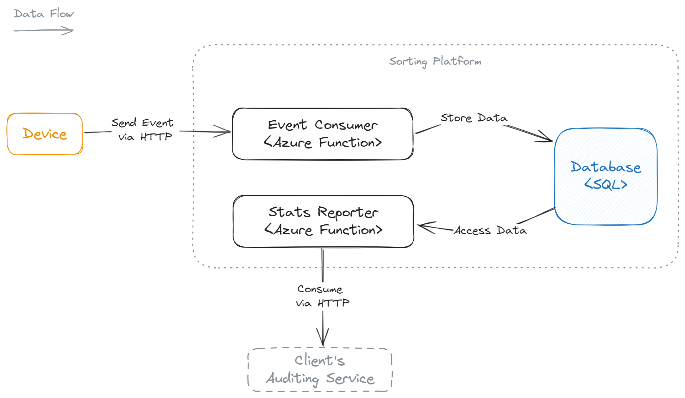

# Lesson 1

# Course introduction

## Lecturers

- **Tomáš Pajurek** - CTO at Spotflow, Team Lead and Software Architect at Datamole.
- **David Nepožitek** - TODO

[Datamole](https://www.datamole.ai/) helps industrial companies become more sustainable and profitable by developing innovative data & AI-driven solutions. [Spotflow](https://spotflow.io/) is Datamole's spinoff, building industrial IoT platform for managing devices and collecting data reliably at scale.

## Course outline

See the [Course Outline](../README.md) in the root of the repository.

# What is cloud

- On-demand compute & storage resources accessible over the Internet.
- Mostly multi-tenant.

## Models

- **Infrastructure as a Service (IaaS)**: virtual machines, disks, networking, dedicated machines.
- **Platform as a Service (PaaS)**: web servers, databases, serverless, Kubernetes.
- **Software as a Service (SaaS)**: applications, analytics, machine Learning, geospatial, etc.

# Designing systems for the cloud - the good parts

## Easily accessible infrastructure for prototyping

- New ideas can be tested immediately without up-front investments and delays.
- Infrastructure for the applications can be added just-in-time.
  - Including e.g. GPUs, NVMes, SGX/SEV.

## Capacity of the system can be adjusted easily & dynamically

- No need to plan too far ahead.
- Suitable for incremental development.
- No need to over-allocate resources. Infrastructure over-provisioning can be avoided with pay-as-you-go pricing.
- The capacity of the system can be adjusted/scaled to current demand.
- The scaling is very flexible and can be even on a less-than-hourly basis.

## Relatively easy geo-distribution

Compared to on-premises solutions, deploying the system in multiple regions is easier if needed.

## Adjustable trade-off between customizability/versatility and operational overhead

Different systems or even different parts of a single system can choose the trade-off between:

- IaaS services that can be highly customized but bring higher operational overhead and high-level
- PaaS and SaaS services that are not as customizable but bring lower operational overhead.

## Flexible system architecture

- Infrastructure can be redesigned at any time.
- The cost of provisioning new infrastructure does not have to be considered.
- ROI of existing infrastructure does not have to be considered.

# Designing systems for the cloud - the not-so-good parts

## Transient failures happen regularly

Network errors, overloaded servers, unavailable services, VMs being restarted, and DNS being reconfigured are a norm, software running in the cloud must be designed to handle them.

## Management of cloud resources

Everything is exposed as an API over the Internet. There is no layer of physical security as in traditional data centers. Every mistake in configuration or access control is a very serious one.

Also, from time to time, some cloud service is deprecated which require migration to another service.

## Vendor lock-in

IaaS services are quite generic and portable. However PaaS and SaaS services are often very specific to the cloud provider and migration to other providers is hard or not possible without system redesign (e.g. due reliance on specific service guarantees or cost model).

## Data residency & privacy

- Significant issue for some companies.
- Government access requests?

## Costs

- Quite complicated cost structure - compute, storage, egress, ingress, and more.
- Can be much more expensive than comparable on-premises "bare metal" hardware.
- For predictable workloads, cost can be optimized with capacity reservations but will be higher than on-premises.

# What is an IoT solution

There are multiple points of view:

## Development of hardware and embedded software

- Performance.
- Reliability.
- Power usage.
- Real-time.

## Integration

- Deployment of devices into the field
- Networking.
- Security.
- Updates.

## Cloud/Backend

- (Stateful) connection of many devices.
- Storing of data.
- Processing of data.
- Cloud-to-device communication.

# Interesting challenges for backend/cloud services in IoT solutions

The development of backends for IoT solutions is software engineering like any other. However, there are some challenges that are more common in IoT solutions than in typical business applications. Also, many of these challenges are also relevant for observability solutions.

## Connectivity and hardware of IoT devices is far from perfect

- Long connectivity disruptions, as well as other failures are a norm, not an exception.
- Network bandwidth is limited.
- Disk space is limited.
- Harsh prioritization is needed.
- Extremely unreliable clocks on devices

## In-order time-series data processing

It is much easier to process data from devices if there are at least some guarantees about ordering.

In-order processing is not trivial in distributed systems.

- Retries, fail-overs.
- Trade-off with high availability.

## Huge amounts of relatively low-value data compared to typical business applications.

Logging/tracing every single transaction (e.g., collecting one sensor reading) is not feasible:

- Designing a logging/tracing strategy is non-trivial.
- Debugging is harder.

## Trade-off between throughput and latency

Typical IoT solutions need at least some functionality to work close to real-time manner (to have minimal latency from device sending a data point to time moment when the data point is processed).

Low latency negatively impacts throughput (e.g., possibility of batching of data points limited).

## Geo-distribution of devices

Devices (clients) that are distributed across the globe (or at least across multiple regions) bring additional challenges:

- Varying network reliability and latency.
- Might lead to geo-distributed system architecture.

# Overview of relevant Azure resources

## Azure SQL Database

Azure Docs: https://learn.microsoft.com/en-us/azure/azure-sql/database

PaaS serving as a general-purpose SQL transactional database built on-top of the Microsoft SQL Server.

## Azure Functions

Azure Docs: https://docs.microsoft.com/en-us/azure/azure-functions/

Serverless PaaS for running pieces of code (functions) with minimal management overhead.

### HTTP Trigger

The function is triggered by an HTTP request and its return value is the HTTP response to the request.

## Azure Resource Manager (ARM) Templates

Azure Docs: https://docs.microsoft.com/en-us/azure/templates/

Infrastructure as Code (IaC) tool for Azure services. It allows to define the infrastructure in a declarative way (JSON). It is useful to manage large deployments in repeatable and predictable way.

```json
{
  "$schema": "https://schema.management.azure.com/schemas/2019-04-01/deploymentTemplate.json#",
  "contentVersion": "1.0.0.0",
  "resources": [
    {
      "type": "Microsoft.Storage/storageAccounts",
      "apiVersion": "2022-09-01",
      "name": "mystorageaccount",
      "location": "westeurope",
      "sku": {
        "name": "Standard_LRS"
      },
      "kind": "StorageV2"
    },
  ]
}
```

# Case study problem statement

Your client operates a delivery company with five sorting facilities. In these facilities, robots retrieve parcels from the inbound zones and transport them to the outbound zones, where they are prepared for the next stages of delivery. The client wants to keep track of the parcel movement within the facilities and get daily reports.

**Example:**

Robot R-1 moves parcel 4242 from inbound zone I-12 to outbound zone O-25 in 40 seconds .

**The client needs answers for the following:**

- What was the daily volume of parcels transported within the facilities?
- What was the daily average transportation time?
- How did the parcel 4242 move within a facility F-1 on a day 20-04-2024?

They want to consume the data via HTTP API from their auditing service.

## Ideas - discussion

```

````

## Resulting design



## Components

- HTTP API
  - Event Consumer
  - Stats Reporter
- Storage

### API

#### Event Consumer

Request Method: `POST`

Request Query Parameters: None

Request Body:

```json
{
  "transportId": "15asd55cvgh",
  "parcelId": "sf546ad465asd",
  "facilityId": "prague-e12",
  "transportedAt": "2022-04-05T15:01:02Z",
  "locationFrom": "in-25",
  "locationTo": "out-35",
  "transportDurationSec": 31,
  "deviceId": "sorter-1654345"
}
````

Response Code:

- `201 Created` - Event was successfully stored.
- `400 Bad Request` - Body is not in the correct form.

Response Body: None

### Reporter

#### Daily Statistics

Request Method: `GET`

Request Query Parameters:

- `date`- a day for which the statistics are calculated in form of `yyyy-MM-dd`

Request Body: None

Response Code

- `200 OK` - Statistics calculated and returned in the body
- `204 No Content` - No events for the given day exists
- `400 Bad Request` - The query parameter `day` is not correct

Response Body:

```json
{
  "day": "20220405",
  "totalTransported": 42,
  "avgDurationOfTransportationSec": 40.2
}
```

#### Transport Information

Request Method: `GET`

Request Query Parameters:

- `date`- a day of transportation in form of `yyyy-MM-dd`
- `facilityId`- name of the sorting facility
- `parcelId`- id of the parcel

Request Body: None

Response Code

- `200 OK` - Statistics calculated and returned in the body
- `204 No Content` - No events for the given day exists
- `400 Bad Request` - The query parameter `day` is not correct

Response Body:

```json
{
  "transportedDate": "2022-04-05",
  "facilityId": "prague",
  "parcelId": "123",
  "transportedAt": "2022-04-05T15:01:02+00:00",
  "locationFrom": "in-25",
  "locationTo": "out-35",
  "timeSpentSeconds": 31,
  "deviceId": "sorter-1654345",
  "transportId": "15asd55cvgh"
}
```

## Implementation

### Deploy the infrastructure

Prerequisites: [Azure CLI](https://docs.microsoft.com/en-us/cli/azure/install-azure-cli)

Clone the repository

```
git clone https://github.com/datamole-ai/mff-cloud-app-development.git
```

Navigate to the `lesson-1/arm` directory and see the [ARM template](/lesson-1/arm/resources.azrm.json). It contains

- Function App
- Storage Account
- App Insights

First thing is to create a new resource group. In the following command, replace the `<resource-group>` with your own name (e.g. "mff-iot-<name>-<surname>").

```pswh
az group create --location 'WestEurope' -n <resource-group>
```

Edit the values in the `lesson-1/arm/resources.azrm.parameters.json` so they are unique.

Then, deploy the infrastructure defined in `lesson-1/arm/resources.azrm.json` with the following command.

```pwsh
cd lesson-1/arm
az deployment group create `
  --name "deploy-mff-task-components" `
  --resource-group "mff-lectures" `
  --template-file "resources.azrm.json" `
  --parameters "resources.azrm.parameters.json" `
  --parameters adminPassword=<password-to-sql-server>
```

You should copy the Connection String to the database for local development. It should appear in the output as follows:

```json
"outputs": {
  "sqlConnectionString": {
    "type": "String",
    "value": "Server=tcp:mff-iot-sql-...database.windows.net,1433;Initial Catalog=transports;User ID=mffAdmin;Password=<password-to-sql-server>;"
  }
}
```

### Create Azure Functions from a template

Prerequisites: [Azure Functions Core](https://docs.microsoft.com/en-us/azure/azure-functions/functions-run-local?tabs=v4%2Cwindows%2Ccsharp%2Cportal%2Cbash#install-the-azure-functions-core-tools)

Create Azure Function .NET project ([docs here](https://docs.microsoft.com/en-us/azure/azure-functions/create-first-function-cli-csharp?tabs=azure-cli%2Cbrowser#create-a-local-function-project))

```pwsh
mkdir ./iot-usecase-1
cd ./iot-usecase-1
func init "AzureFunctions" --worker-runtime "dotnet-isolated" --target-framework "net8.0"
```

Create the individual Azure Functions

```pwsh
cd ./iot-usecase-1/AzureFunctions

func new --name "Reporter" --template "HTTP trigger" --authlevel "function"
func new --name "GetDailyStatistics" --template "HTTP trigger" --authlevel "function"
func new --name "GetTransport" --template "HTTP trigger" --authlevel "function"

```

## Publish Azure Functions

```pwsh
cd iot-usecase-1/AzureFunctions
func azure functionApp publish "<name-of-the-functionapp>" --show-keys
```

In the output, you will receive URIs of each azure function. Put them down.

```
    EventConsumer - [httpTrigger]
        Invoke url: https://<name-of-the-functionapp>.azurewebsites.net/api/eventconsumer?code=<code>

    GetDailyStatistics - [httpTrigger]
        Invoke url: https://<name-of-the-functionapp>.azurewebsites.net/api/getdailystatistics?code=<code>

    GetTransport - [httpTrigger]
        Invoke url: https://<name-of-the-functionapp>.azurewebsites.net/api/gettransport?code=<code>
```

You can test the function with your HTTP client of choice:

```
curl "https://<name-of-the-functionapp>.azurewebsites.net/api/gettransport?code=<code>"
```

## Actual Implementation

### Set up Database Schema

Open [Azure Portal](https://portal.azure.com/) in you browser.

Find the SQL Database resource.

Go to Query Editor in the left panel.

Login using the admin credentials.

Execute the following query:

```sql
CREATE TABLE [Transports] (
    [TransportedDate] date NOT NULL,
    [FacilityId] nvarchar(255) NOT NULL,
    [ParcelId] nvarchar(255) NOT NULL,
    [TransportedAt] datetimeoffset NOT NULL,
    [LocationFrom] nvarchar(max) NOT NULL,
    [LocationTo] nvarchar(max) NOT NULL,
    [TimeSpentSeconds] bigint NOT NULL,
    [DeviceId] nvarchar(max) NOT NULL,
    [TransportId] nvarchar(max) NOT NULL,
    CONSTRAINT [PK_Transports] PRIMARY KEY ([TransportedDate], [FacilityId], [ParcelId])
);
```

### Set up the Code

You can find the reference implementation in `sln/AzureFunction`.

Note that it is definitely not production-ready for many reasons (missing error-handling, validations, observability).
It should rather serve as a minimal example on how to glue the Azure resources and code together.

## Test

### Event Consumer

Powershell

```pwsh
$body = @{
  locationFrom="a";
  locationTo="b";
  transportDurationSec=30;
  parcelId="1";
  transportedAt="2022-04-05T15:01:02Z";
  deviceId="sorter-123";
  facilityId="facility-123";
  transportId="t-4156";
} | ConvertTo-Json

 Invoke-WebRequest -Uri <event-consumer-uri> -Method Post -Body $body -ContentType "application/json"
```

cURL

```sh
curl -X POST -H "Content-Type: application/json" \
    -d '{"parcelId": "12345","facilityId": "prague","transportedAt": "2022-04-05T15:01:02Z", "locationFrom": "in-25",  "locationTo": "out-35",  "transportDurationSec": 50,  "deviceId": "sorter-1654345", "transportId": "t-4156"
}' \
    <URI>
```

### Reporter

#### Daily Statistics

Powershell

```pwsh
Invoke-WebRequest -Uri "https://<name-of-the-functionapp>.azurewebsites.net/api/getdailystatistics?code=/<func_code>&date=2022-04-05"
```

cUrl

```sh
curl "https://<name-of-the-functionapp>.azurewebsites.net/api/getdailystatistics?code=/<func_code>&date=2022-04-05"
```

#### Individual Transport

Powershell

```pwsh
Invoke-WebRequest -Uri "https://<name-of-the-functionapp>.azurewebsites.net/api/gettransport?code=/<func_code>&date=2022-04-05&facilityId=prague&parcelId=123"
```

cUrl

```sh
curl "https://<name-of-the-functionapp>.azurewebsites.net/api/gettransport?code=/<func_code>&date=2022-04-05&facilityId=prague&parcelId=123"
```

Log output of each function can be read via Portal -> Function App `<name-of-the-functionapp>` -> Functions -> Select the Function -> Monitor -> Logs tab

### Local Test

**NOTE:** Only http triggered function can be tested locally.

Add the connection string from arm deployment to `local.settings.json`. They will be accessible to the function as enviromental variables and also automatically loaded as configuration.

```json
{
  "IsEncrypted": false,
  "Values": {
    "AzureWebJobsStorage": "UseDevelopmentStorage=true",
    "FUNCTIONS_WORKER_RUNTIME": "dotnet-isolated",
    // Add this:
    "TransportsDbConnectionString": "<the-connection-string-from-arm>"
  }
}
```

Then navigate to `<project-root>/sln/AzureFunctions` and [run](https://docs.microsoft.com/en-us/azure/azure-functions/functions-run-local?tabs=windows%2Ccsharp%2Cbash#start)

```pwsh
func start
```

Then use the requests from the section [Test](#Test).

### Storage Check

Open [Azure Portal](https://portal.azure.com/) in you browser.

Find the SQL Database resource.

Go to Query Editor in the left panel.

Login using the admin credentials.

Find the table: Tables -> dbo.Transports.

Right-click and select "Select Top 1000 Rows".
