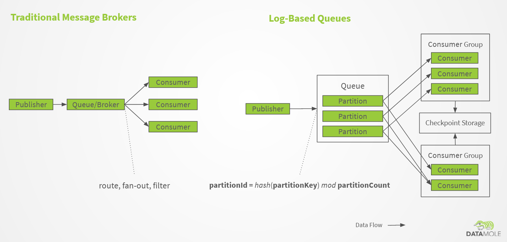
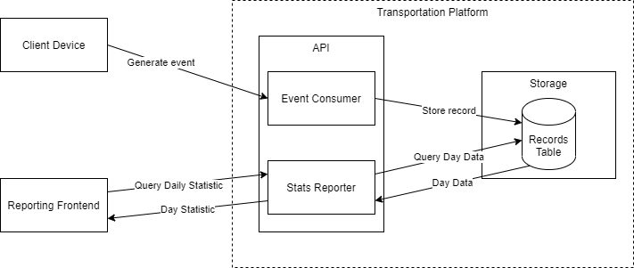
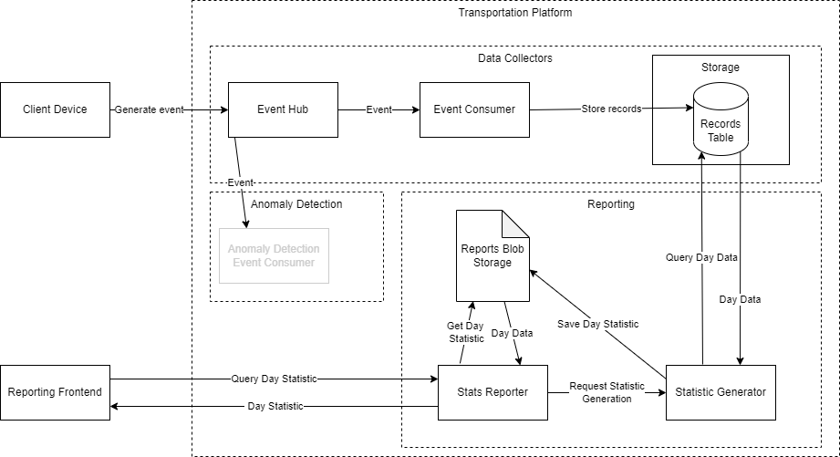
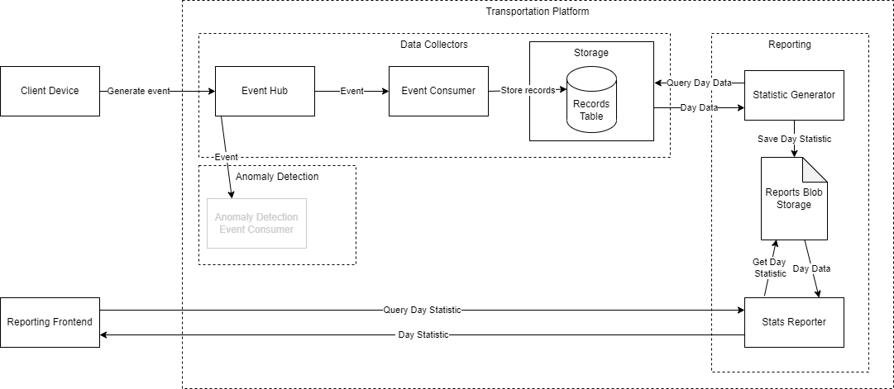

# Lesson 2

## Overview of relevant Azure resources

### Messaging

* Why messaging?
  * Components decoupling
  * Improves scalability.
  * Improves resiliency.
  * Might help reducing architectural complexity.
    * Publish-subscribe.
  * Might be more difficult to implement correctly.

* Azure Service Bus vs. Azure Event Hubs




| Traditional message brokers (Azure Service Bus) | Log-based queues (Azure Event Hubs) |
| -------------- | -------------- |
| Very smart piece of infrastructure. | Acts more like a simple storage for sequential data. |
| A lot of features (deduplication, TTL, dead-lettering, routing) | Only a few features. |
| Consumers are more reactive. | Consumers are more proactive. 
| Broker is responsible for keeping track of completed messages. | Consumer is responsible for keeping track of completed messages. |
| Lower throughput. | Higher throughput. |
| Not great horizontal scalability. | Very good horizontal scalability (partitioning). |
| In-order processing not possible (typically). | In-order processing possible. |
| RabbitMQ,  Azure Service Bus, Amazon SQS,  JMS | Apache Kafka, Azure Event Hub, Amazon Kinesis |


### Azure Functions (Event Hub Trigger)

* Differences and similarities to HTTP trigger.
* Checkpointing.
* Retries.

# Problem

The situation has changed in the following way: 
- The business is thriving and the number of smart warehouses is about to increase from one to a hundred.
- The clients request a simple anomaly detection tool.

The architecture will need to be adjuste at multiple places.

## API

The clients need to send an id of the warehouse they belong to and our Event Collector, Reporter and transports table need to be adjusted. 

## Reporting

We can expect increase demand of requests not only for the separate warehouse but even for the same warehouse (more people need the same data). The Report endpoint can no longer calculate the statistics on-the-fly, it should either precompute them or cache them in some storage.

## Anomaly Detection

This feature is developed by a different team (they will maybe use [Azure Stream Analytics](https://azure.microsoft.com/en-us/services/stream-analytics/#features) or something else, we don't know) but we need to integrate with them.

# Design

This is the previous design.




- The input data would require a new field `warehouseId` and this needs to be propagated throughout the system
- We would need abandon Azure Function event consumer in favor of event hub because of predictable scaling and that each event is now being read by two different components.
- More requests on reporter requires us to avoid on-the-fly computation. We can 
  - Create a cron job that will process the data for the previous day.
  - Create the reports on demand.

**Note** that working with time is a hassle. Daylight savings, time zones, manual changes is an issue in distributed programing. Therefore we expect all records to come from one timezone and the datetime corresponds precisely to the time of the transportation.



## Discussion

* Various statistics calculation and caching strategies (on-the-fly, on-the-fly with cache, cron).
  * Deduplication of calculation requests
```


 


 
 
``` 

* Deduplication of incoming messages
  * Device-side duplication
  * Service-side duplication
* Azure Tables partioning strategy


## Components

- Event Hub
- HTTP API
  - Reporter
- Storage
  - Transport Table
  - Report Blobs
- Processing
  - Event Consumer
  - Statistic generator

The Azure Function Event Consumer has been abandoned from the following reason
- We have more than one event processor. The Azure Function accepting the request would need to store the event and notify the Anomaly Detection component which is not desirable (synchronous calls should be performed carefully).
- Predictable scaling behavior. Event Hub allows us to remove coupling between Event producer and Azure Function. While Azure Functions can scale out, it still takes a while and could cost a fortune. Putting events to the Event Hub allow us to smooth the spikes and if needed it does not block us from adding more consumers to help out with the situation.
- An error in the function will cause loss of data. 

## API Changes

### Event Consumer

Add `warehouseId`: 

```json
{
  "warehouseId": "Prague1",
  "objectId": "electronics-box-1",
  "transportedDateTime": "2022-04-05T15:01:02Z",
  "locationFrom": "rack-25",
  "locationTo": "rack-35",
  "transportDurationSec": 31
}
```

### Reporter

Add a Request Query Parameters: 
- `warehouse`- an ID of a given warehouse


```json
{
  "warehouseId": "Berlin5",
  "day": "20220405",
  "totalTransported": 42,
  "avgDurationOfTransportationSec": 40.2,
}
```


# Implementation

* Event Consumer Api - [Event Hub](https://docs.microsoft.com/en-us/azure/event-hubs/)
* Storage - [Azure Blob storage](https://docs.microsoft.com/en-us/azure/storage/blobs/storage-blobs-introduction)

## Upgrade the Infrastructure

We will add an Event Hub with two consumer groups, one for each type of consumers - Anomaly Detection component and Event Consumer. On the top of that we will add a blob storage to store the cached reports.

We can use the same resource group as previously since the ARM template deployment is idempotent therefore the existing architecture won't be affected.

**Deploying ARM templates is idempotent, we don't need to delete the previous resource group**

```powershell
az deployment group create `
  --name "deploy-mff-task-components" `
  --resource-group <resource-group> `
  --template-file "lesson-2/arm/resources.azrm.json" `
  --parameters "lesson-2/arm/resources.azrm.parameters.json"
```

In the output, you will get sending and listening connection strings. Note them somewhere, you will need the sending connection string in the event generator and the listening one should you want to debug the solution.

## Adjust the Event Consumer

We add a new property `warehouseId` to the class representing request `Transport`:

```cs
[JsonPropertyName("warehouseId")]
public string WarehouseId { get; set; }
```

The `TransportEntity` will be changed as well. We will keep the transported date as a row key (because we still want to perform querying based on a datetime). To keep the querying efficient, we will re-define row key as a combination of warehouse Id and a transport Id so it would be unique and ordered by the warehouse. The design is based on the tips from the [documentation](https://docs.microsoft.com/en-us/azure/storage/tables/table-storage-design-for-query).

And we reflect that in the function mapping from model to entity.

## Change EventConsumer function from HTTP Trigger to Event Hub Trigger

Documentation (https://docs.microsoft.com/en-us/azure/azure-functions/functions-bindings-event-hubs-trigger?tabs=in-process%2Cfunctionsv2%2Cextensionv5)

```cs
public static class EventConsumer
{
    
    private const string _eventHubName = "client-events";
    private const string _eventHubSenderConnectionString = "clientEventsListenerEventHubConnectionString";
    
    [Function("EventConsumer")]
    public static void Run(
        [EventHubTrigger(_eventHubName, Connection = _eventHubSenderConnectionString)] 
        Transport[] transports, 
        FunctionContext context)
    {
        var logger = context.GetLogger("EventConsumer");
        logger.LogInformation($"First Event Hubs triggered message: {transports[0].ObjectId}");
        
        // TODO storing logic similar to the previous one
    }
}
```
# Semetral project

Assignment: [semestral-project-assignment.md](../semestral-project-assignment.md)


